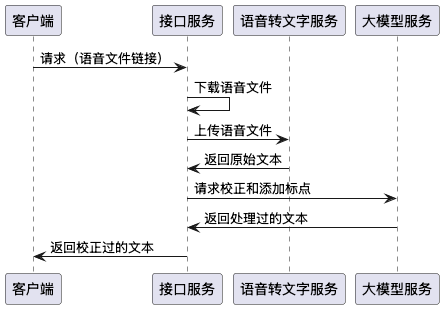

# 野火ASR服务
野火ASR服务包含3个部分，工作流程如下：接口服务接收客户端请求，把请求中的文件地址下载下来后，再调用野火语音转文本服务，得到文本后再调用大模型添加标点符号和修正错误。



1. ***接口服务***：本项目是接口服务，使用springboot编写；
2. ***语音转文本服务***：是个C++服务，是收费的，需要野火提供；
3. ***大模型服务***：任意大模型服务，只要能够对文本进行处理就行。

## 费用
野火语音转文本服务是收费的，价格是1万块钱，关于野火价格请点击[这里](https://docs.wildfirechat.cn/price/)，可以先用体验版测试，如果测试效果满意，请联系野火购买软件包或者源码。

大模型服务需要自己准备，私有部署的或者公有云的都行。这个是可选的，如果没有也没有问题。

## 依赖
只支持X86_64和ARM64 CPU和Linux系统。因为使用了[ggml](https://github.com/ggml-org/ggml)，一些旧的CPU和旧的Linux系统可能不支持，所以当购买之前先测试一下体验版。

## 启动ASR服务的步骤：
接口服务、语音转文本服务和大模型服务可以部署到一起，也可以分开部署。下面是部署方法：

### 1. 启动wf-voice服务
下载 [野火语音转文本服务体验版](https://gitee.com/wfchat/wf-voice-trail) 中对应操作系统和架构，再下载项目中的model模型文件，软件包解压，得到两个可执行文件，wf-voice是程序文件，ffmpeg是音频转码工具。
```
nohup ./wf-voice -m ./model/wf-voice-small.gguf -p 4 2>&1 &
```
其中命令中```-p```这个参数是指定允许并行的个数，每路需要2核CPU。如果是单独部署，```-p```参数应设置为cpu核数/2。如果是与其他服务部署，则规划好为这个服务分配多少核CPU，参数为CPU/2。

这个服务是分CPU架构的，注意要是用正确架构版本。

启动后，服务监听12435端口。

### 2. 准备大模型
可以私有部署大模型，或者购买第三方云服务。如果没有也可以先跳过。

### 3. 创建数据库
接口服务需要使用数据库。部署MySQL数据库，执行如下命令创建asr数据库
```
create database asr;
```

### 4. 启动ASR服务
修改本项目配置文件，配置语音转文本服务和大模型服务的地址。默认配置是本机，如果部署在同一台服务器上不用修改配置。如果大模型服务需要认证，还需要配置 `llm.api_key`。

配置文件示例：
```properties
asr.server_url=http://127.0.0.1:12435/inference
asr.use_llm_correct=true

llm.server_url=http://127.0.0.1:11434/api/generate
llm.model_name=xxxx
llm.api_key=sk-xxxxxxxx
```

使用命令```mvn clean package```打包本项目代码，把jar包放到服务器上使用命令执行：
```
java -jar asr-api-0.1.jar
```

### 5. 防火墙
* 语音转文字服务：不需要对外访问，12435端口接收接口服务的请求。防火墙禁止出访；只允许接口服务访问12435端口，其他地址和端口禁止入访。
* 大模型服务：处理好端口的联通性。
* 接口服务：需要访问语音转文字服务的12435端口和大模型服务的11434端口；需要对外访问能够把语音文件下载下来；需要暴露8200给客户端调用。1，出访语音转文字服务的12435端口，出访大模型服务的11434端口；2，出访对象存储服务IP和端口（如果链接可能是任意地址，那就是需要出访全部开放了）；3，放开8200的入访。

如果部署在同一台服务器上：1，出访对象存储服务IP和端口（如果链接可能是任意地址，那就是需要出访全部开放了）; 2，放开8200的入访。

### 6. 使用命令测试：
在接口服务所在服务器上使用命令测试：
```
curl -X POST -H "Content-Type: application/json" -d '{"url":"https://media.wfcoss.cn/firechat/222.m4a", "noReuse":true}' http://127.0.0.1:8200/api/recognize
```

## 接口
只有一个API，请参考测试命令：
```
curl -X POST -H "Content-Type: application/json" -d '{"url":"https://media.wfcoss.cn/firechat/222.m4a", "noReuse":true}' http://127.0.0.1:8200/api/recognize
```
url为语音文件链接，可以是常见语音格式；noReuse不复用之前的结果，当为false时，如果有历史请求，会立即返回历史结果。上线时noReuse要为false；测试时注意设置合适的参数。

## 反向代理
这是个HTTP的服务，有可能使用反向代理或者负载均衡。为了尽快展现给用户，响应是流式返回的，如果使用NG等反向代理或者负载均衡等，需要关闭掉缓存。在Nginx配置中添加:
```nginx
proxy_buffering off;
```
在其他反向代理或者负载均衡请查找手册关闭缓存功能。

## 常见问题
### 1. 性能如何？
A. 语音转文本服务性能非常好，2核心CPU每秒可以处理5-10秒语音，使用CPU即可。

### 2. 是否可以不用大模型？
A. 语音转文本的效果也算可以，但没有标点符号和断句，如果只要语音转文本服务，性能会非常好。可以在配置文件中关掉大模型，或者请求参数不使用大模型。但建议还是用上大模型，做一些简单的校正和添加标点符号。

### 3. 有时发现特别慢？
A. 我们发现当CPU出现竞争时会特别慢。注意配置路数，避免超过CPU总数。

### 4. 测试发现等待较长时间，然后一次出现响应，不像野火测试服务一小段一小段返回？
A. 这有可能网络中间环节有缓存。请在接口服务器上，使用```curl -X POST -H "Content-Type: application/json" -d '{"url":"https://media.wfcoss.cn/firechat/222.m4a", "noReuse":true}' http://127.0.0.1:8200/api/recognize``` 测试看看是不是一小段一小段的响应。确认服务正常后，再去查找是中间那个环节出了问题。如果有nginx或者其他网络中间件，请检查是否没有关闭了缓存。

### 5. 如何添加认证信息，避免被盗用？
A. 本项目中其实包含了认证相关的代码，请参考配置文件中的```server.need_signature```，根据这个配置可以找到相关代码。可以使用[SignUtils](./src/main/java/cn/wildfirechat/asr/utilis/SignUtils.java)，来生成签名。如果需要认证，可以参考已有代码进行二开。

### 6. 如何处理统计数据
A. 本项目把每个请求都记录到了数据库中，可以二开来统计转换的各种信息。
